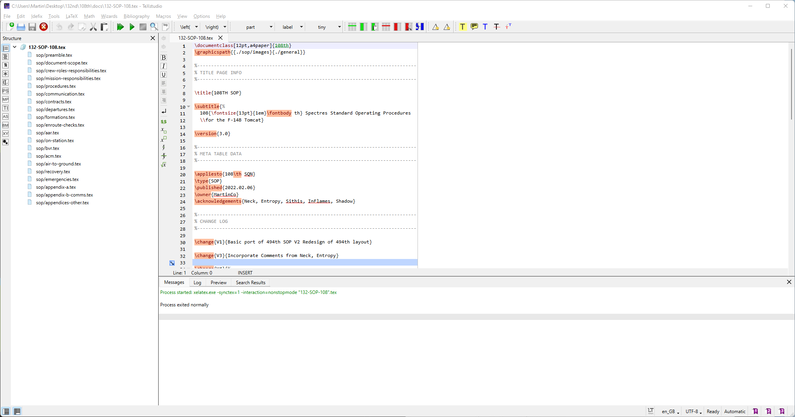
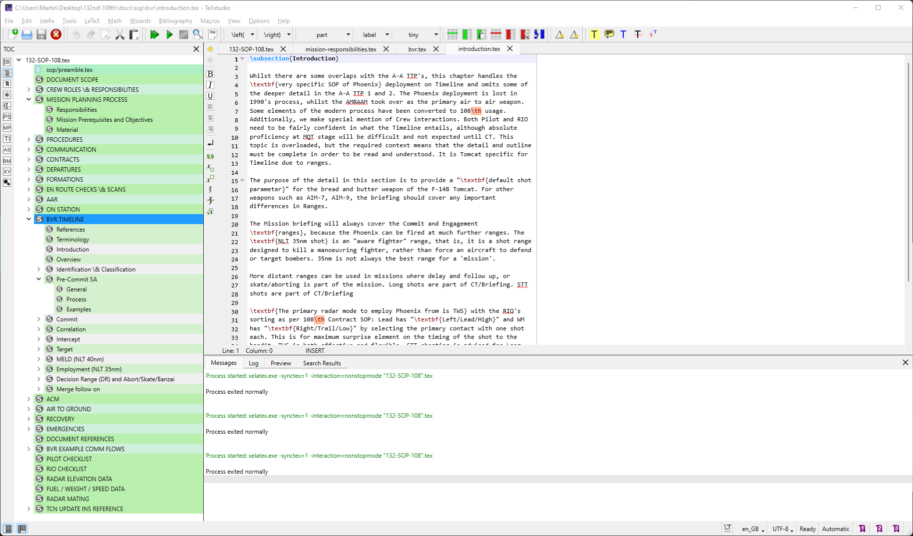
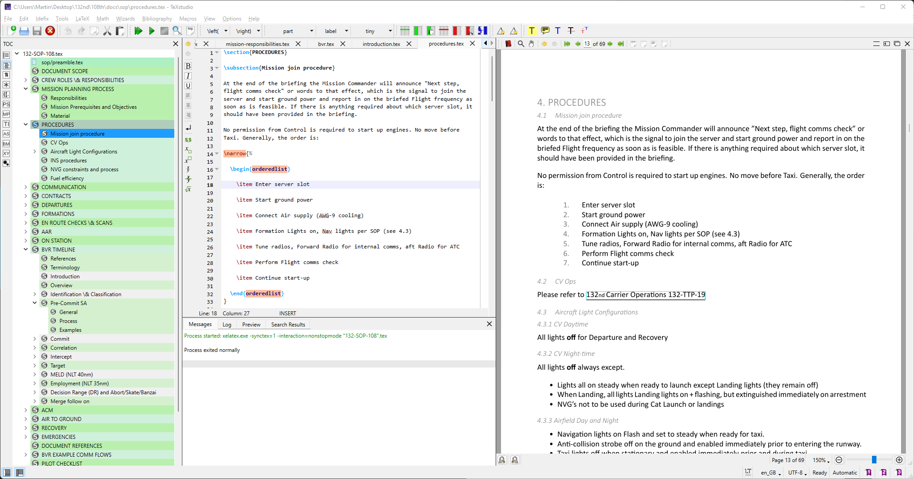

# 108th Documentation

## Overview

The SOP and other documents were previously authored in Word. This lead to files being shared, the versions published not being the same as in shared drives and other issues such as inconsistent title formatting, page margins, and text formatting.

Resolving these issues represented a large time investment, which was coupled with a desire to ensure a no cost barrier editing, maintaining, and updating the document and so we decided to migrate them to LaTeX hosted in this Git Repository.

This allows us to more easily facilitates collaboration across multiple source files and far more easily manage version control and history.

## Why LaTeX 

LaTeX's well established ability to separate the content and formatting controls, maintaining section references and formatting work really well to lower the burden on edits.

Whilst this can be quite daunting on initial look, for the most common usage required in maintaining a document this should be relatively pain free along with free softwware to manage and author.

## Software Setup

### TeX Live 

TeX Live is the base package which requires all the tools needed for compiling tex documents

* Download and Install TexLive from https://tug.org/texlive/acquire-netinstall.html
* Direct Installer: https://mirror.ctan.org/systems/texlive/tlnet/install-tl-windows.exe

### TeX Studio

This is my preferred editor

* Download and Isntall TexStudio from https://www.texstudio.org/
* Direct Installer: https://github.com/texstudio-org/texstudio/releases/download/4.2.1/texstudio-4.2.1-win-qt6.exe

### TeX Studio Preferences

These are preferences that I feel work well for editing:

* Launch TeX Studio
* From the Top Menu, Select Options -> Configure Tex Studio
* On the bottom left Check "Show Advanced Options"
* On the left hand menu, select and edit the following parameters
  * Build
    * Meta Commands
      * Default Compiler: xelatex
  * Editor
    * Editor
      * Check "Replace Tab in Text by Spaces"
      * Check "Replace Indentation Tab by Spaces"
      * Check "Remove Trailing Whitespace on Save"
      * Show Line Numbers: "All Line Numbers"
  * Adv. Editor
    * Appearance
      * Tab Width: 2
    * Special Options:
      * Line Wrapping: "Soft line wrapping after max. Characters"
      * Maximal Characters: 80
* Close TeX Studio
  * Doing this ensures the preferences are saved

## Downloading 

Downloading the latest copy of the document can be done either:

* Via git
* Directly from this repository from: Code -> Download ZIP

## Editing Process

* Open up the `132-SOP-108.tex` file
* You should now be greeted with

* We have created new files for each Section, sections can include subfiles, as can be seen in bvr.tex 
  * Clicking the section in the left side will automatically open up the file for editing
* You can also view a Table of Contents view by selecting the TOC icon on the left vertical toolbar  

## Compiling / Viewing

* All you need to do his hit "F5"
  
* When you hit F5, the integrated PDF browser will automatically navigate to where your cursor is allowing quick interative viewing of the target section

## Updating

If you are comfortable with git

* Request push rights to this repository in order tto push a change branch
* Submit a patch to someone who has rights
* Zip and Send up your folder which includes the changes to someone who has rights

These can then be easily viewed and merged into the latest files